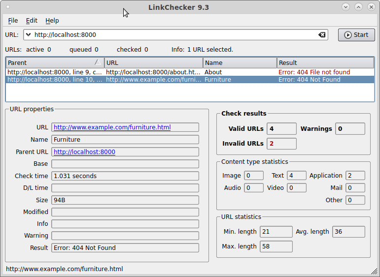
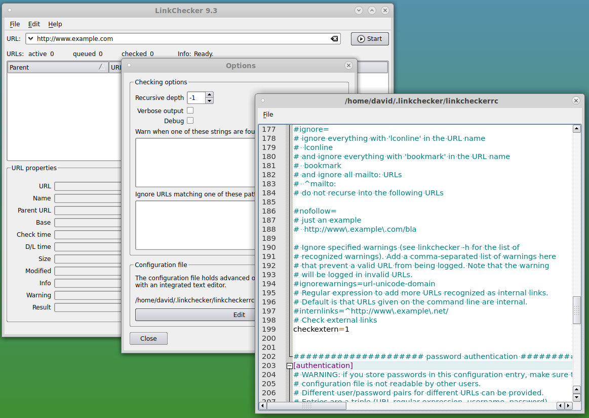

## Checking for Broken Links on Your Website

Links in your web pages will become invalid if the page they point to is
deleted or renamed. Since you will seldom visit every page on your own
website, this problem can remain unnoticed for a long time, until, maybe,
one of your visitors reports it. Automated tools help you to proactively
fix the problem.

A good tool for doing this is [Linkchecker](https://wummel.github.io/linkchecker/).
The way it works is:

1. You give it the URL of a web page such as the homepage of your site.
2. Linkchecker loads that page and finds links on it.
3. It then loads each of those pages and goes back to step three.
4. When there are no more pages to check, Linkchecker prints a list of
   pages which are linked to but which do not actually exist.

Now if you were reading this description carefully, you may have noticed that 
Linkchecker could follow a link from your site to another site and keep going
until it had checked most of the World Wide Web! It does not do that, of course.
It limits itself at step two by either ignoring links which point off your site
entirely, or by only checking that these pages exist without attempting to test
the links on them.

### Running Linkchecker From the Command Line

There are a number of ways to run Linkchecker. One is from the command line.
For example:

    linkchecker http://www.example.com

This will start at www.example.com and check all the pages linked thence directly
or indirectly as long as they are within that website. It will then print a 
report.

If you want to make sure that the links to external websites are good, you 
add the **--check-extern** option:

    linkchecker --check-extern http://www.example.com

For each broken link Linkchecker will give you the link and the page on your site
on which it was found. You should go to that page and either remove or correct
the link. When you have fixed all the broken links, you should run Linkchecker
again to make sure you did not miss any and that your fixes are correct.

### Running the GUI Version of Linkchecker

<figure class="right_edge">

<figcaption>The Linkchecker GUI</figcaption>
</figure>

There is also a GUI version of Linkchecker. To use it you enter the starting
URL into the **URL** field and press **Start**. The broken links will be
displayed in a table. Click on the rows in order to open them in the default
view below.

<figure class="right_edge">

<figcaption>Linkchecker Configuration</figcaption>
</figure>

There is no control in the GUI to turn on **--check-extern**. To enable this
feature you must edit the configuration file. To do this from the GUI:

1. Go to the **Edit** menu and choose **Options**. An options window will appear.
2. Towards the bottom of the option window you will see **Configuration file**.
   Click on the **Edit** button. The configuration file will be opened in a text editor.
3. Scroll down to the **[Filtering]** section and find **checkextern=1**.
4. Remove the # sign in front of this line.
5. Go to the **File** menu at the top of the editor window and choose **Save**.
6. Close the editor window and the options window.

linkchecker_conf.png
linkchecker.png
