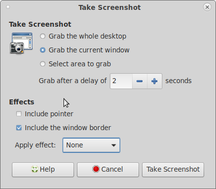

## How to Take Screenshots

1. Open the application of which you wish to take a screenshot.
2. Consider hiding or disabling unnecessary and distracting user interface
   elements such as extra toolbars.
3. Load example content into the application. Make sure it does not include
   private information.
4. Reduce the size of the application's window as much as possible while still
   illustrating the point you wish to make.
5. Take the actual screenshot using one of the methods below.

### Screenshot on Microsoft Windows

The simplest way to take a screenshot in Microsoft Windows is:

1. Press Shift and the Print Screen key. This will save the entire
   screen as an image in the clipboard. You can then open
2. Open a graphics program such as Paint, Pinta, or the Gimp and 
   paste the image onto the canvas.
3. Trim the image to show only the application's window or part of
   its window.
4. Save the image in PNG format.

### Screenshot on MacOS

1. Press and hold Shift, Command, and 4 all together.
2. Tap on the spacebar.
3. Move over the application window. It will be highlighted.
4. Click on it. The screenshot will be saved as a PNG file on your desktop.

### Screenshot on Linux

Linux desktop systems generally have a screenshot program in the menu. When you
open it, it will look something like this:

Most likely you will want to choose to **Grab the current window** as we have done
here. You then press the **Take Screenshot** button. You then have two seconds
to bring the window you want to screenshot to the front by clicking on its title bar.
The screenshot program will then show you a preview of the screenshot and give
you a chance to save it as a PNG file.

### Convert a Web Page to SVG

* https://stackoverflow.com/questions/12005860/can-i-export-part-of-an-html-page-to-an-svg-image
