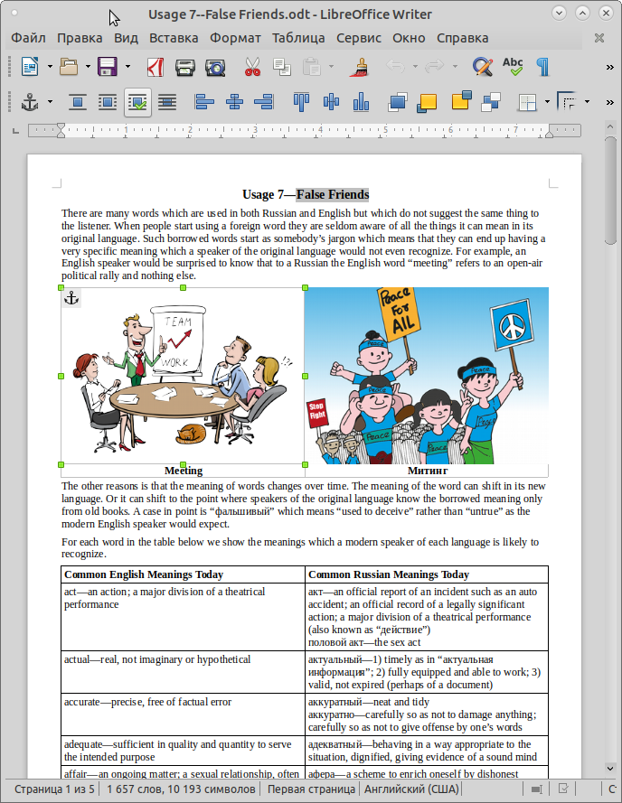
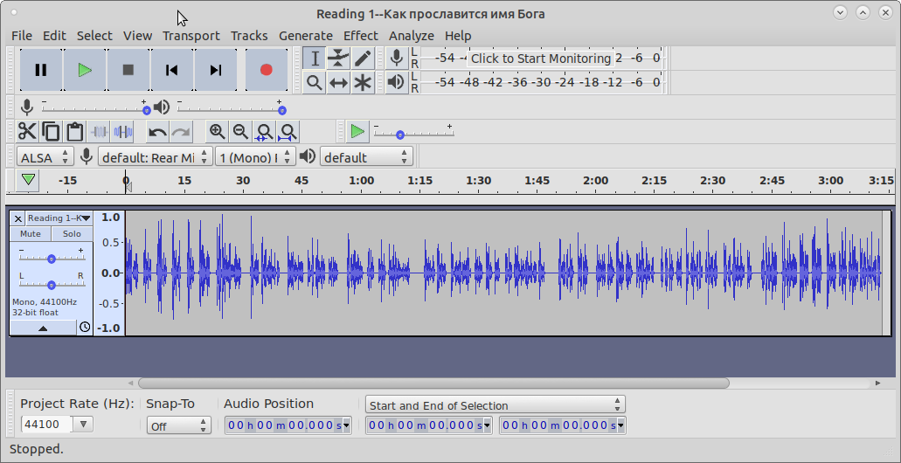

## Software for Creating Lessons

The programs listed on this page may proved useful to you for preparing course
materials. They are all available for free as [opensource software](https://opensource.org/).
We have favored software which works on Linux, Microsoft Windows, and Mac OS X.

Software for creating course materials should be easy-to-use. You should not
have to spend years learning how to produces decent results. It should also be
readily available to all so that you can share what you produce with your
colleges who can then modify them for their needs. Finally it is best if your
work can be stored in widely accepted formats which you will be able to open
and use again for years.

There requirements are not easy to meet. Programs for creative endevors can be
very expensive. They often save your work in files which only they can open.
Sometimes the format of these files changes between versions making it hard to
open files you created only a few years ago.

We also know that our readers use a variety of computers. While Microsoft
Windows is widely used, Apple Macintosh computers are very popular in
education. A few, including your author use Linux. For these reason, we try to
only recommend programs which run well on all three platforms.  All of the
programs recommended are available free-of-charge on the Internet from
reputable web sites.  Finally, to the maximum extent possible we have chosen
programs which either save in industry-standard formats or can export to such
formats.

Most of these programs we actually use regularly and can recommend.
In a few cases we describe well-known programs which we found unsuitable or
which we are still evaluating.

### Document Preparation and Viewing
<figure class="right_edge">
	
	<figcaption>Libreoffice Writer</figcaption>
</figure>
* [Libreoffice](https://www.libreoffice.org/) --
	Libreoffice is a version of the popular [Openoffice](https://www.openoffice.org/) suite.
	This version is updated more frequently than the original.
	We particularly recommend the word processor which is called Write. Its native
	document format is ODF which is an international standard and can be read and
	written by most other word processors including Microsoft Word. See our
	[Libreoffice Cookbook](../howto/libreoffice/) for hints on using Write to produce
	classroom handouts.
* [ODF Format Specification](http://docs.oasis-open.org/office/v1.2/cs01/OpenDocument-v1.2-cs01.html) --
	Technical description of the file format used by Libreoffice. ODF files
	are ZIP archives which contain XML files in a format which is relatively
	easy (for a programmer) to parse and convert into other formats such
	as HTML.
* [Odt2html](https://github.com/david672orford/odt2html) --
	A Python script for converting ODF files to responsive web pages.
	There are a number of ways to convert ODT (ODF word processing) documents to
	HTML. For example, Libreoffice can save in HTML format, but the files it
	produces are intended to produce an exact representation of the printed
	document, not to produce good web pages which look good on screens
	of various sizes. In contrast Odt2html puts the production of good clean
	reflowable HTML first while preserving most formatting. To run this
	program you must have Python 2 installed on your computer.
* [Evince](https://wiki.gnome.org/Apps/Evince/)
	Document viewer for electronic document formats including PDF and DjVu.
	The version for Microsoft Windows is on [Fosshub](https://www.fosshub.com/Evince.html).
	Ubuntu MATE includes Atril which is a version of Evince.
* [Calibre](https://calibre-ebook.com/) --
	High quality ebook reader and ebook management system.
* [Xournal++](https://xournalpp.github.io/) --
	Note taking and PDF annotation.

Other noteworthy programs:
	[Abiword](https://www.abisource.com/),
	[Calgra Words](https://www.calligra.org/words/),
	[OnlyOffice](https://github.com/ONLYOFFICE/),
	[WordGrinder](https://cowlark.com/wordgrinder/)

### Lecture Slides
* [Revealjs](https://github.com/hakimel/reveal.js) --
	Javascript library which makes it easier to create presentation slides
	in HTML. Scales them properly to fit the screen and provides controls
	for switching slides, revealing points one at a time, etc. The library
	is free. If you do not know how to write HTML, there is an online
	presentation editor, but that requires a paid subscription.
* [Jessyink](http://tavmjong.free.fr/INKSCAPE/MANUAL/html/Extensions-JessyInk.html)
	An Inkscape extension (included) which makes each layer a slide in an
	presentation. It adds Javascript to the SVG file so that when it is
	viewed in a web browser one can page through the slides.

### Audio Processing
<figure class="right_edge">
	
	<figcaption>Audacity</figcaption>
</figure>
* [Audacity](https://www.audacityteam.org/) --
	An excellent audio editor. You can load audio from files in formats
	including MP3 and WAV. If you have a microphone, you can record right
	in Audacity. You can then trim the audio, remove noise, adjust its tone,
	and combine multiple audio clips on a timeline. You can save the project
	to continue working on it later. When you are ready, you can export
	the finished audio in WAV, FLAC, MP3, and OGG formats.

### Video Processing and Viewing
* [VLC](https://www.videolan.org) --
	A good solid all-around video player which will play most any file.
	Has classic media player controls.
* [Shotcut](https://www.shotcut.org) --
	This is a good non-linear video editor. Such editors emulate the
	process of editing motion picture film using scissors and tape.
	Video shots recorded earlier are loaded, trimmed and placed in the desired
	order on a timeline. Still images, titles, and smooth transitions (such as
	fads and wipes) are be added. The finished product is exported as a
	single video file.
	See our article [Using Shotcut](shotcut/).
* [OBS Studio](https://obsproject.com/)
	This program simulates a video switcher such as used at a TV broadcast
	station to control what is going out over the air. It is often used for
	live streaming on Youtube or feeding the projector in a lecture hall. Live
	elements from video cameras or screen captures can be combined with
	elements prepared earlier such as video clips, slides, overlays, and
	music. An operator chooses which elements to display as the program is
	being broadcast or recorded.
* [Handbrake](https://handbrake.fr/) --
	Handbrake is an easy-to-use program for ripping DVD’s and converting
	video files from one format to another.
* [FFmpeg](https://www.ffmpeg.org) --
	Very capable command-line program for converting audio and video files
	from one format to another or making them smaller in preparation for
	distribution. It has numerous options for cropping video, selecting
	start and end times, and much more. As a command-line tool, FFmpeg takes
	more effort to use the first few times, but once you have figured out
	the commands you need, you can make a cheat sheet or a script so that
	you can use them quickly without struggling to figure out what buttons
	you pressed in some GUI conversion tool. There are FFmpeg cookbooks on the
	web where you can find most of the commands you will need. These include
	[FFmprovisr](https://amiaopensource.github.io/ffmprovisr/). See also
	our instructions for [trimming video using FFmpeg](../howto/trim-video/).
* [Youtube-DL](https://ytdl-org.github.io/youtube-dl/index.html) --
	A command-line program for downloading videos from Youtube and dozens
	of other websites. Useful if you want to show a video in class. You give
	it the URL of the video's webpage and it does the rest.

Other noteworthy programs:
	[Openshot](https://www.openshot.org/),
	[Kdenlive](https://kdenlive.org/)

### Raster Image Editing
Photographs are stored in a computer as an array of tiny dots. Drawings
done on a computer or scanned from paper may also take this form. If you
want to crop the image or alter its brightness, contrast, color tone,
or sharpness, you need a raster image editor. If you have the skills
and a suitable image editor, you can perform more radical alterations
such as removing distracting or unsightly details or even whole objects.
* [GIMP](https://www.gimp.org/) --
	The GIMP is a very capable image editor. It is the opensource world's
	first answer to Adobe's Photoshop. People either love it or hate it.
	Common criticisms are that the user interface is cluttered and poorly
	organized, and that its behavior is different from that of most other
	editors for no obvious benefit. If you use it only occasionally,
	you will spend an inordination amount of time trying to remember how
	to perform even basic tasks. Most casual users will be better
	off with Pinta or Krita.
* [Pinta](https://pinta-project.com) --
	This edit has a basic set of features which will be sufficient for the needs of many users.
	It is not nearly as capable as the GIMP, but far easier to use.
	Suitable for cropping photos, adjusting their color, and removing redeye and blemishes.
	Has simple tools for freehand drawing, adding shapes and lines, and adding text.
	You can create multiple layers.
	Can load and save in OpenRaster, BMP, PNG, JPEG, TIFF, and other formats, but seeminly not GIF.
	Pinta is a clone of Paint.Net which in turn was inspired by Microsoft Paint.
	Highly recommended.
* [Krita](https://krita.org/) --
	While Pinta is primarily for editing photographs, Krita is primarily for drawing and painting.
	It has numerous brushes which can be used with a mouse or a drawing tablet.
	Has vector graphics layers which can be loaded from and saved to SVG files.
	Vector shapes can be copied between Krita and Inkscape.
	Has provisions for frame-by-frame animation of raster (but not vector) layers.
	Takes about 10 times as long to start as Pinta does.
* [Imagemagick](https://www.imagemagick.org) --
	If you need to convert one or two images, you can use one of the raster
	graphics editors described above. But if you are processing hundreds
	of images, you are better off using Imagemagick. It can be used as a
	command-line program or you can use it as a library from your favorite
	programming language.

### Vector Drawing
* [Inkscape](https://inkscape.org/) --
	An excellent vector drawing program which uses SVG as its native format.
	We discuss Inkscape in our article [How to Create Illustrations](../illustration/).
* [Krita](https://krita.org/) --
	While Krita is mainly a program for drawing by painting pixels, version 4.0 has
	vector layers with support for SVG.
* [Dia Diagram Editor](http://dia-installer.de/) --
	Program for drawing flowchards, circuit diagrams, etc. Includes a huge
	library of symbols for drawing everything from flowcharts to electronic
	circuits. Unlike Inkscape, Dia saves its drawings in its own private
	format. You should keep your work copy in this format and export
	the finished drawing in a standard format such as SVG or PNG.
* [Libreoffice Draw](https://www.libreoffice.org/) --
	A vector drawing program adapted for office document preparation.
	In additional to tools for drawing basic shapes such as rectangles
	and circules, it offers a wide variety of special-purpose tools for
	such things as flowcharts, labels, banners, and 3D primatives such
	as spheres, cones, and cylinders.
	Like Dia, Libreoffice Draw has its own file format.
	Finished drawings can be exported in formats including SVG and PNG.

### 3D Modeling
* [Blender](https://www.blender.org) --
	This is the definitive opensource 3D modeling program. It is very capable
	and serious users can get good work done quickly. However it requires a serious
	time commitment to learn it, so it is not a good choice for occasional use
	to create simple models.
* [Art of Illusion](http://www.artofillusion.org) --
	An easy-to-use 3D modeler. Written in Java, so it will run on most computers.
	Saves in its own inscrutible format, but can export in OBJ and VRML formats.
* [Sweet Home 3D](http://www.sweethome3d.com) --
	An easy-to-use program for creating 3D models of rooms with doors, windows, and furniture.
	See our article [Using Sweethome 3D](sweethome/).

### Other Software Lists
* [34 open source tools for creatives](https://opensource.com/article/16/12/yearbook-top-open-source-creative-tools-2016) --
	Describes applications for creating documents, drawings, videos, music, typefaces, and 3D models
* [Sil Language Technology's Products](http://software.sil.org/products/) --
	Software to help produce texts in languages for which adequate typefaces, dictionaries, and
	other tools are not yet available.
* [9 flowchart and diagramming tools for Linux](https://opensource.com/article/18/8/flowchart-diagramming-linux) --
	Describes programs for producing diagrams such as flowcharts, organizational charts, and circuit schematics.	
* [Pixls](https://pixls.us/software/) --
	A photographer's list of opensource tools

### Unfinished Evaluations

* [Unfinished Evaluations](draft)
* [3D Modeling](3d-modeling)

