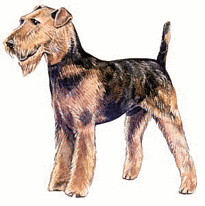

## Stock Material for Lessons

The term **stock material** refers to representations such as drawings,
photographs, and video clips which are kept on hand for future use in
larger works such as articles and documentary films. For example if we
were writing a history lesson we might search for "stock" photographs
of the persons involved in the events described. If we were writing about
a concept such as "family" or "cooperation", there might be a stock photograph
or drawing to illustrate the idea.

### Legal Considerations

There are three basic ways to obtain stock material: 1) is to save
your own photographs and drawins which you think may be useful in the future,
2) to buy the material from a commercial service when you need it, and 3)
to obtain it from online collections.

If you choose option two or three, you should pay careful attention to the
legal terms, since they may limit how you can distribute the lessons which you
produce. For example, a license which prohibits commercial work may prevent you
from using the stock material in a textbook which is sold. Or the license may
require that you include a notice crediting the creatore of the stock material.
This will require extra work on your part.

Material which is in the public domain can be used freely with no restrictions
on modification and no requirement to name the source. Most material that is
in the public domain entered it because the copyright term expired.
Nowadays some material enters the public domain because the copyright holder
has waived all rights. This is frequently done using the
[CC0 Public Domain Dedication](https://creativecommons.org/publicdomain/zero/1.0/).

From the standpoint of one who wants to use stock material, the next best thing
to the public domain is a [Creative Commons license](https://creativecommons.org/licenses).
That is because these licenses clearly spell out how you may use a work, including whether you may
modify it or incorporate it into your work, and any notices which you must provide.

Beware of sites with licenses written by amateurs. These are often vague, confusing,
contradicatory, and fail to cover common situations.

You should keep notes on where you obtained your stock material, particularly if
you will be putting it on line. That way you can show you obtained it legitimately
if anyone every questions this. A lawyer, Faye Gelb provides
[advice](https://www.quora.com/What-is-the-best-way-to-get-free-pictures-for-my-website/answer/Faye-Gelb)
on how to do this. You should be able to save this information in or alongside 
your project files.

### Vector Drawings
<figure class="right_edge">
	
	<figcaption>From Openclipart.org</figcaption>
</figure>
* [Openclipart](https://openclipart.org/) --
	Tens of thousands of vector drawings in SVG format. Quality varies from
	excellent to awful. All are in the public domain. Site was down for
	much of 2019, but as of January 2020 its is back up, though seemingly
	without a search function.
* [Public Domain Vectors](https://publicdomainvectors.org/)
	60,000 public domain vector images. Includes some of the better
	material from Openclipart.
	Search results from Shutterstock (a comercial supplier of stock art)
	are displayed alongside the search results and this can be confusing at times.
* [Pixabay Vectors](https://pixabay.com/vectors/)
	Pixabay is best known for high-resolution stock photographs, but they also
	have tens of thousands of vector drawings.

### Pictures Intended for School Projects
<figure class="right_edge">
	
	<figcaption>From Pdclipart.org</figcaption>
</figure>
* [Pics4Learning](http://pics4learning.com/) --
	Good-quality photographs in moderately high resolution sorted into
	categories such as "National Parks", "Dinosaurs", and "Parts of Your Body".
	Not in the public domain. The [image use policy](https://pics4learning.com/about.php)
	grants permission only "for use by students and teachers in an educational setting".
* [Wpclipart](https://wpclipart.com/) --
	Tens of thousands of drawings of acceptable to good quality.
	Most are in raster format though a few are in SVG. Includes simple drawings
	done on computers, photographs, and scans of old book illustrations.
	Sorted into categories such as "energy", "cartoon", and "science".
	The [terms of use](https://wpclipart.com/terms.html) indicate that the
	pictures are in the public domain. Project of a single person who vets the
	images to make sure they are really in the public domain and suitable
	for children.
* [Public Domain Clipart](https://www.pdclipart.org/) --
	25 thousand drawings in low to medium resolution raster format. A mix of
	colored line drawings, what look like old book illustrations, and
	photographs. Many are from US Government sources. The quality is generally
	good. 

### High-Resolution Stock Photographs
<figure class="right_edge">
	
	<figcaption>From Pixabay.com</figcaption>
</figure>

There are quite a number of sites which offer high-resolution photographs of
landscapes, objects, and people. Often these photographs are contributed by
photographers who want to share their work.

Originally, these sites used the Creative Commons Public Domain Dedication
(CC0) to release these photographs to the public domain, or if the law did not
allow that, to offer a very broad fallback license. This was very convenient
for users who did not need to study license terms or worry about whether
they had included all the required legal notices. But it eventually created a
problem for the sites. This was that upstart sites could simply copy all of
their best photographs. This was perfectly legal. Eventually the two biggest
sites (Pixabay and Unsplash) stopped releasing the photographs to the public
domain and instead licensed them under terms which they consider very permissive
but which prohibit other sites from taking the pictures. Sadly, these licenses,
while good as readable statements of what they intend to accomplish, are not
backed up by a comprehensive precisely worded license document written by
lawyers. This leaves a lot of grey areas, particularly for those who wish to 
incorporate these photographs into larger works which they intend to release
under a free-culture license such as Creative Commons.

Confusion continues. In May of 2019 a company called [Canva](https://about.canva.com/)
[announced](https://about.canva.com/news/canva-acquires-pexels-pixabay/)
that it had bought Pixabay and Pexels. The announcement says that the photos
will be "completely free under a Creative Commons CC0 licence". However,
as of January 2020 the licenses on these sites are unchanged.

* [Pixabay](https://pixabay.com/) --
	Large collection photographs and a smaller number drawings and video clips.
	Tends toward the artistic and the illustration of themes. Some are artistic
	montages with heavy atmospheric filtering. Has some nudes. (There is a
	filter for excluding them.) Used CC0 until January 9, 2019, after which they
	use the [Pixabay License](https://pixabay.com/service/license/).
* [Unsplash](https://unsplash.com/) --
	Used CC0 until sometime between May 30 and June 8, 2017 when they switched to the
	[Unsplash Licensing](https://unsplash.com/terms).
	Unsplash has [acknowledged](https://medium.com/@UserRoadmap/unsplash-is-no-longer-under-a-cc0-license-do-you-care-13d5656053b7)
	that CC0 still applies to photos uploaded before the license change, but decline
	to identify the CC0 photographs on their site.
* [Pexels](https://www.pexels.com/) --
	As site similiar to those of Pixabay and Unsplash.
	Uses a similiar informally-worded [license](https://www.pexels.com/photo-license/).
* [Stocksnap](https://stocksnap.io/) --
	Images of nature, landscapes, people, illustration of themes. [Uses the
	CC0 public domain dedication.](https://stocksnap.io/license)
	Watch out though, when you search they display results from Shutterstock
	before their own results which is very confusing. That a photograph is
	from Shutterstock is indicated only be a small start in a yellow tab
	in the top-left corner.
* [StockVault](https://www.stockvault.net) --
	Uploaders choose a [license](https://www.stockvault.net/terms-of-use)
	or CC0 public domain dedication.
* [Kaboompics](https://kaboompics.com/) --
	A photographer named Karolina Grabowska has posted about 15,000 of her own pictures.
	The [license](https://kaboompics.com/page/license-and-faq) is similar to
	those used by Pixabay and Unsplash.

### Other Image Collections
<figure class="right_edge">
	
	<figcaption>From Wikimedia Commons</figcaption>
</figure>
* [Wikimedia Commons](https://commons.wikimedia.org/wiki/Main_Page) --
	Collection of images, sounds, and video collected for use in Wikipedia and
	other projects. Check the information page for each image to see why it is
	considered suitable for use in Wikipedia. Grounds are that it is in the
	public domain, that it has been released under a suitable license, or that
	its use in the online encyclopidia is fair use.
* [Flickr: The Commons](https://www.flickr.com/commons) --
	Collection of public domain images posted by over 100 public institutions.
	Includes the [Internet Archive Book Images](https://www.flickr.com/photos/internetarchivebookimages/)
	described in [this announcement](https://blog.archive.org/2014/08/29/millions-of-historic-images-posted-to-flickr/).
	Be sure to always start your search from search box in the middle of the
	Commons home page. If you accidently use the search box at the top of that
	or any other page, you will be searching all of Flickr instead.
* [Public Domain Q](https://publicdomainq.net/)
	Public domain photos, illustrations, and photographs of paintings. Site is in
	Japanese, but can be navigated without too much trouble using a web browser
	(such as Google Chrome) which does automatical translation.
* [NCI Visuals Online](https://visualsonline.cancer.gov/) --
	Photographs and drawings provided by the National Cancer Institute.
	Copyright status indicated for each. They
	[ask to be credited as the source](https://visualsonline.cancer.gov/about.cfm)
	even for the public domain images.
* [Rawpixel's Public Domain Images](https://www.rawpixel.com/category/53/public-domain)
	Fantastic collection of images taken from out-of-copyright books, chromolithographic
	plates, and US government sources. Includes fine art paintings, high quality
	illustrations of persons, places, floura and fauna, illustations and photographs
	from NASA.

### Image Search Engines
* [Librestock](https://librestock.com/) --
	Search dozens of free stock photo sites at once
* [Creative Commons Image Search](https://search.creativecommons.org/) --
	Search the internet for images with a [Creative Commons](https://creativecommons.org/)
	license. If you wish, you can limit your search to the more
	permissive licenses.

### Video
* [Librestock](https://video.librestock.com/) --
	Search for CC0-licensed videos from stock footage sites
* [Vimeo](https://vimeo.com/creativecommons) --
	Videos on Vimeo which are tagged as being in the public domain or under
	a [Creative Commons license](https://creativecommons.org/license).
* [Videvo](https://www.videvo.net/) --
	Video clips, many under a [Creative Commons license](https://creativecommons.org/license).
* [Videzy](https://www.videezy.com/) --
	More video clips. License terms indicated for each video.
* [Pond5](https://www.pond5.com/public-domain-curated-collections) --
	High-quality new stuff costs money, but they offer some old public
	domain stuff for free.

### 3D Models and Textures
* [Blend Swap](https://www.blendswap.com) --
	Artists share models created with Blender. Many have been dedicated to
	the public domain or shared under a [Creative Commons license](https://creativecommons.org/licenses).
* [Blogscopia](https://resources.blogscopia.com) --
	Over 100 3D models in multiple formats including Blender and Sweethome3d.
* [Open Game Art](https://opengameart.org/) --
	Large searchable archive of 3D models, textures, and other video game assets
	released to the public domain or under a permissive license such as the
	[GNU](https://www.gnu.org/licenses/) or [Creative Commons](https://creativecommons.org/licenses)
	licenses.

### Sound Effects
* [Freesound.org](https://freesound.org) --
	Over 400,000 sound effects released under
	[Creative Commons licenses](https://www.creativecommons.org/licenses).
* [Gamesounds.xyz](https://gamesounds.xyz) --
	Someone's collection of sound libraries which he believes are free to use.
	It appears that each top-level folder is a separate collection with its
	own terms. In most cases these are in a file called "LICENSE". We have traced
	some of these collections to their original sources:
    * [99Sounds](http://99sounds.org/) (
    * [BBC Sound Effects Library](http://bbcsfx.acropolis.org.uk/) (16,000 BBC sound effects licensed for "personal, educational or research purposes")
    * [Kennedy's Sound Pack](https://www.kenney.nl/)
    * [Octave-UISounds](http://www.raisedbeaches.com/octave)
* [Soundbible.com](http://soundbible.com) --
	Hundreds of sound effects which are either in the public domain or released
	under the Creative Commons Attribution 3.0 license
* [FXhome](https://fxhome.com/sound-effects) --
	A few hundred sound effects downloadable as sets in ZIP files.
	All under the Creative Commons Attribution 3.0 license
* [Open Game Art](https://opengameart.org/) --
	Large searchable archive of sound effects and other video game assets
	released to the public domain or under a permissive license such as the
	[GNU](https://www.gnu.org/licenses/) or [Creative Commons](https://creativecommons.org/licenses)
	licenses.

### Royalty Free Music
* [MusOpen](https://musopen.org) --
	Classical music recordings in the public domain or under a [Creative Commons](https://www.creativecommons.org) license.
	In addition to recordings, this site offers sheet music and textbooks.
	It is not clear what is the source of these music recordings and who performs in them.
* [IncompeTech](https://incompetech.filmmusic.io/) --
	Original and classical music performed by Kevin MacLeod.
	Released under the [Creative Commons Attribution 4.0 License](http://creativecommons.org/licenses/by/4.0/).
	Some of this music is also available on his [old site](http://incompetech.com/).
* [Youtube Music Library](https://www.youtube.com/audiolibrary/music) --
	Searchable collection of hundreds of music tracks which Google has approved
	for use in Youtube videos. Includes tracks from
	[Kevin MacLeod](http://incompetech.com/),
	[Chris Zabriskie](http://chriszabriskie.com/),
	[Kevin Shaw](https://audionautix.com/), and
	[Twin Musicom](http://www.twinmusicom.org/)
	under a [Creative Commons Attribution license](https://creativecommons.org/licenses/by/4.0/).
	For tracks which do not require attribution, the performer's name is sometimes
	linked to his Youtube channel.
* [Open Game Art](https://opengameart.org/) --
	Large searchable archive of music and other video game assets
	released to the public domain or under a permissive license such as the
	[GNU](https://www.gnu.org/licenses/) or [Creative Commons](https://creativecommons.org/licenses)
	licenses.

### Icon Sets
* [Nuvola SVG Icons](https://commons.m.wikimedia.org/wiki/Category:Nuvola_SVG_icons) --
    Icon set created for the GNOME desktop
* [Crystal Clear Icons](https://commons.wikimedia.org/wiki/Category:Crystal_Project) --
    Icon set created for the KDE desktop, in PNG format
* [The Noun Project](https://thenounproject.com/)
	Goal of project is described as "building a global visual language that
	unites us. Provides color photographs and black-and-white icons to represent
	things and concepts. Icons are either in the public domain or under a Creative
	Commons license requiring attribution. Other terms are available for a fee.

### Other Stock Materials
* [Global Digital Library](https://home.digitallibrary.io/) --
	Open license children's books ready for translation

### Other Lists
* [List of sites at Wikipedia](https://commons.m.wikimedia.org/wiki/Commons:Free_media_resources/Photography)
* [List of sites at Wordpress.org](https://make.wordpress.org/themes/handbook/review/resources/#recommended-websites-for-images)
* [Where can I find images that are free to use?](https://www.quora.com/Where-can-I-find-images-that-are-free-to-use)
* [Best Stock Footage Sites You Wished You Already Knew!](https://blog.templatetoaster.com/best-stock-footage-sites/)
* [Wikipedia:Free sound resources](https://en.m.wikipedia.org/wiki/Wikipedia:Free_sound_resources)
* [Where can I find free sound effects?](https://sound.stackexchange.com/questions/25298/where-can-i-find-free-sound-effects)
* [13 Sources For Free Public Domain and CC0-Licensed Images](https://christianlivingbooks.com/13-sources-for-free-public-domain-and-cc0-licensed-images/)
* [Pro Theme Design: Free Stock Photos](https://prothemedesign.com/tools/free-stock-photos/)
